# Serverless Expense Tracker (V3)

This is my personal, full-stack expense tracking ecosystem built for high performance, edge scalability, and a premium native iOS/Web experience. I built this project to have complete control over my financial data without relying on third-party subscriptions, utilizing a blazing-fast **Cloudflare Workers** backend, a beautifully designed **React Native (Expo)** mobile application, and a **Next.js** web dashboard.

---

## 🏗 Architecture Overview

The system consists of three main pillars:

1. **The Edge Network Backend** (Cloudflare Workers + D1)
2. **The Mobile Application** (Expo + React Native + Supabase Auth)
3. **The Quick-Action Integration** (Apple iOS Shortcuts)

### 1. Cloudflare Workers Backend (`/src`)

The API is built using [Hono](https://hono.dev/), deployed globally on Cloudflare Workers, and backed by a **Cloudflare D1** (Serverless SQLite) database.

**Key Features:**

- **Dual Authentication System:**
  - Accepts standard **JWTs** via Bearer tokens generated by Supabase (used by the mobile app).
  - Accepts **Static Long-Lived API Keys** (used securely by external automations like iOS Shortcuts).
- **Date Filtering:** Optimized backend queries explicitly filter by `startDate` and `endDate` natively in D1, returning only relevant data vectors to minimize payload sizes over slow cellular networks.
- **RESTful Endpoints:** Complete CRUD for `transactions` (Income & Expenses).

### 2. Mobile App (`/expense-app-mobile`)

A premium user interface built with **Expo SDK 54**, **NativeWind (TailwindCSS)**, and **React Query**. Designed meticulously to mirror the native Apple iOS 17/18 deep dark OLED aesthetic.

**Key Features:**

- **Auth Flow:** Secure login/signup powered by Supabase.
- **V3 Native Dashboard:**
  - A dynamic, interactive **Donut Chart** (`react-native-gifted-charts`).
  - **Dynamic Categorization:** Categories aren't hardcoded. The app parses unique categories from the backend array and automatically assigns them rotating iOS System Colors (Emerald, Blue, Yellow, Purple) and Ionicons on the fly.
  - **Interactive Legend:** Tap any category legend to instantly filter your recent transactions list below.
  - **Smart Monthly Budgeting:** Set a custom monthly budget limit via a native modal (persisted via `AsyncStorage`). Visualizes your spending progress with dynamic warning thresholds.
- **Performant Data Caching:** `react-query` handles all parallel fetching, optimistic updates, and offline caching.

### 3. Native iOS Shortcuts Integration

The defining convenience feature of this stack.
Users can generate a unique `API Key` directly from the Mobile App's Settings tab. This key can be pasted into a custom [Apple iOS Shortcut](https://www.icloud.com/shortcuts/a066d55051cd4144b17edf9a6d5a554e).

Once configured, you can log expenses without even opening the app:

- _"Hey Siri, log an expense."_
- Quickly tap a Shortcut widget on your iPhone home screen.
- Log expenses directly from your Apple Watch.
  The Shortcut securely hits the Cloudflare Worker API using your static key, appending the expense to your D1 database instantly.

---

## 🛠 Tech Stack

**Backend**

- **Runtime:** Cloudflare Workers
- **Framework:** Hono
- **Database:** Cloudflare D1 (SQLite)
- **Validation:** Zod
- **Auth Provider:** Supabase (JWT Verification)

**Frontend (Mobile)**

- **Framework:** React Native (Expo)
- **Navigation:** Expo Router
- **Styling:** NativeWind (Tailwind CSS v3)
- **Data Fetching:** TanStack React Query (`@tanstack/react-query`) + Axios
- **Animations:** React Native Reanimated
- **Charts:** React Native Gifted Charts

---

## 🚀 Getting Started

### Backend Setup

1. Authenticate with Wrangler: `npx wrangler login`
2. Provision a D1 database and update your `wrangler.jsonc` bindings.
3. Apply the schema: `npx wrangler d1 execute serverless-expense-api-db --local --file=./schema.sql`
4. Run locally: `npm run dev`

### Frontend Setup

1. Navigate to the app directory: `cd expense-app-mobile`
2. Install dependencies: `npm install`
3. Configure Environment Variables: Duplicate `.env.example` into `.env` and fill in your Supabase Auth URLs and local/production Cloudflare Worker API routes.
4. Start the bundler: `npx expo start -c`
5. Open via the Expo Go app on your physical iOS/Android device.

## Architecture

This project implements a **Dual Authentication** architecture that supports both Long-lived static API Keys (for headless environments like Apple Shortcuts) and short-lived JWTs (for traditional App logins).

```mermaid
sequenceDiagram
    autonumber
    actor User as 🧍‍♂️ You
    box rgb(40, 44, 52) iPhone
    participant Shortcut as ⚡️ Apple Shortcut
    participant App as 📱 Mobile App
    end
    box rgb(33, 40, 54) Cloudflare
    participant Worker as 🌩️ CF Worker API <br> (/middleware/auth.ts)
    participant D1 as 🗄️ D1 Database <br> (transactions & api_keys)
    end
    participant AuthEngine as 🔑 Supabase/Google Auth

    %% SHORTCUT FLOW
    rect rgb(30, 80, 50)
    note right of User: Fast Flow (Apple Shortcut)
    User->>Shortcut: Log Expense ($5 Coffee)
    Shortcut->>Worker: POST /api/transactions <br> Header: Bearer [STATIC_API_KEY]
    Worker->>D1: SELECT user_id FROM api_keys WHERE key = [API_KEY]
    D1-->>Worker: Returns { user_id: "550e8400-e29..." }
    note right of Worker: ✅ Shortcut Key Found
    Worker->>D1: INSERT INTO transactions (..., user_id)
    D1-->>Worker: OK
    Worker-->>Shortcut: 200 OK (Expense Created)
    Shortcut-->>User: 🔔 Success Notification
    end

    %% MOBILE APP FLOW
    rect rgb(50, 40, 80)
    note right of User: Analytical Flow (Mobile App)
    User->>App: Opens Mobile App
    App->>AuthEngine: Login Request (Google)
    AuthEngine-->>App: Returns JWT (Temporary Token)

    App->>Worker: GET /api/transactions <br> Header: Bearer [JWT_TOKEN]
    Worker->>D1: SELECT user_id FROM api_keys...
    D1-->>Worker: ❌ Not found (It's a JWT)

    note right of Worker: 🔄 Fallback to JWT Validation
    Worker->>Worker: Verifies JWT signature with JWT_SECRET
    note right of Worker: ✅ Valid JWT. Extracts 'sub' (UUID)

    Worker->>D1: SELECT * FROM transactions WHERE user_id = [JWT_UUID]
    D1-->>Worker: Returns Array [Coffee, Lunch, ...]
    Worker-->>App: 200 OK (Expense List)
    App-->>User: 📊 Displays Charts and History
    end
```

## Automated Deployment on Cloudflare (Backend + Web Frontend)

This repository includes a GitHub Actions workflow in `.github/workflows/deploy.yml`.

### What it deploys automatically

- Backend: Cloudflare Workers API (repository root).
- Web Frontend: Cloudflare Pages from `expense-app-web` (static `out` build).

The workflow runs on `push` to `main` and also supports manual execution (`workflow_dispatch`).
It detects folder changes to avoid deploying both projects if it's not necessary.

### 1) Create/validate resources in Cloudflare (one-time)

- Existing Worker API: `expense-api` (defined in `wrangler.jsonc`).
- Pages project for the web app: Create one named `seva-app-web` (or define another name and configure it as a secret).

### 2) Configure GitHub Secrets

In your GitHub repository, create the following Secrets (Settings > Secrets and variables > Actions):

- `CLOUDFLARE_ACCOUNT_ID`
- `CLOUDFLARE_API_TOKEN`

Recommended optionals (separated tokens for least privilege):

- `CLOUDFLARE_API_TOKEN_WORKERS`
- `CLOUDFLARE_API_TOKEN_PAGES`
- `CLOUDFLARE_PAGES_PROJECT` (defaults to `seva-app-web`)

Frontend build variables (public):

- `NEXT_PUBLIC_SUPABASE_URL`
- `NEXT_PUBLIC_SUPABASE_ANON_KEY`
- `NEXT_PUBLIC_API_URL`

### 3) Suggested minimum permissions for tokens

- Worker token: Account > Cloudflare Workers > Edit.
- Pages token: Account > Cloudflare Pages > Edit.

Always limit each token to the correct account and only to the necessary permissions.

### 4) Deployment Flow

- Push to `main` with API changes: Deploys only the Worker.
- Push to `main` with `expense-app-web` changes: Deploys only Pages.
- From the Actions tab, you can trigger a manual deployment of both using Run workflow.
