# Cloudflare Workers OpenAPI 3.1

This is a Cloudflare Worker with OpenAPI 3.1 using [chanfana](https://github.com/cloudflare/chanfana) and [Hono](https://github.com/honojs/hono).

This is an example project made to be used as a quick start into building OpenAPI compliant Workers that generates the
`openapi.json` schema automatically from code and validates the incoming request to the defined parameters or request body.

## Get started

1. Sign up for [Cloudflare Workers](https://workers.dev). The free tier is more than enough for most use cases.
2. Clone this project and install dependencies with `npm install`
3. Run `wrangler login` to login to your Cloudflare account in wrangler
4. Run `wrangler deploy` to publish the API to Cloudflare Workers

## Project structure

1. Your main router is defined in `src/index.ts`.
2. Each endpoint has its own file in `src/endpoints/`.
3. For more information read the [chanfana documentation](https://chanfana.pages.dev/) and [Hono documentation](https://hono.dev/docs).

## Development

1. Run `wrangler dev` to start a local instance of the API.
2. Open `http://localhost:8787/` in your browser to see the Swagger interface where you can try the endpoints.
3. Changes made in the `src/` folder will automatically trigger the server to reload, you only need to refresh the Swagger interface.

## Architecture

This project implements a **Dual Authentication** architecture that supports both Long-lived static API Keys (for headless environments like Apple Shortcuts) and short-lived JWTs (for traditional App logins).

```mermaid
sequenceDiagram
    autonumber
    actor User as 🧍‍♂️ Tú
    box rgb(40, 44, 52) iPhone
    participant Shortcut as ⚡️ Apple Shortcut
    participant App as 📱 App Móvil
    end
    box rgb(33, 40, 54) Cloudflare
    participant Worker as 🌩️ CF Worker API <br> (/middleware/auth.ts)
    participant D1 as 🗄️ D1 Database <br> (transactions & api_keys)
    end
    participant AuthEngine as 🔑 Supabase/Google Auth

    %% FLUJO DEL ATAJO
    rect rgb(30, 80, 50)
    note right of User: Flujo Rápido (Apple Shortcut)
    User->>Shortcut: Ingresa Gasto ($5 Café)
    Shortcut->>Worker: POST /api/transactions <br> Header: Bearer [API_KEY_ESTATICA]
    Worker->>D1: SELECT user_id FROM api_keys WHERE key = [API_KEY]
    D1-->>Worker: Retorna { user_id: "550e8400-e29..." }
    note right of Worker: ✅ Llave de Atajo Encontrada
    Worker->>D1: INSERT INTO transactions (..., user_id)
    D1-->>Worker: OK
    Worker-->>Shortcut: 200 OK (Gasto Creado)
    Shortcut-->>User: 🔔 Notificación de Éxito
    end

    %% FLUJO DE LA APP MOVIL
    rect rgb(50, 40, 80)
    note right of User: Flujo Lento/Analítico (App Móvil)
    User->>App: Abre la App Móvil
    App->>AuthEngine: Pide Iniciar Sesión (Google)
    AuthEngine-->>App: Retorna JWT (Token temporal)
    
    App->>Worker: GET /api/transactions <br> Header: Bearer [JWT_TOKEN]
    Worker->>D1: SELECT user_id FROM api_keys...
    D1-->>Worker: ❌ No encontrada (Es un JWT)
    
    note right of Worker: 🔄 Fallback a Validación JWT
    Worker->>Worker: Verifica firma JWT con JWT_SECRET
    note right of Worker: ✅ JWT Válido. Extrae 'sub' (UUID)
    
    Worker->>D1: SELECT * FROM transactions WHERE user_id = [UUID_DEL_JWT]
    D1-->>Worker: Retorna Array [Café, Almuerzo, ...]
    Worker-->>App: 200 OK (Lista de Gastos)
    App-->>User: 📊 Muestra Gráficos e Historial
    end
```

