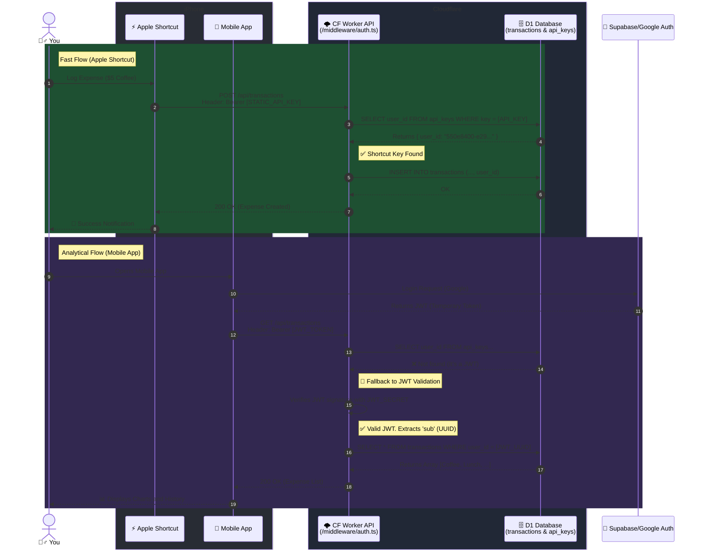

# Serverless Expense Tracker (V3)

This is my personal, full-stack expense tracking ecosystem built for high performance, edge scalability, and a premium native iOS/Web experience. I built this project to have complete control over my financial data without relying on third-party subscriptions, utilizing a blazing-fast **Cloudflare Workers** backend, a **Next.js** web dashboard, and a **React Native (Expo)** mobile application.

---

## 🏗 Repository Structure (pnpm Monorepo)

This repository is structured as a **pnpm Workspace Monorepo** under the `apps/` directory:

```text
serverless-expense-api/
├── apps/
│   ├── api/                     # Cloudflare Workers Backend API (Hono + D1 + Zod)
│   │   ├── migrations/          # Cloudflare D1 SQL Migrations
│   │   ├── src/                 # Worker entrypoints and OpenAPI endpoints
│   │   ├── wrangler.jsonc       # Wrangler configuration
│   │   └── package.json
│   ├── web/                     # Next.js 16 Web Dashboard (Turbopack + Tailwind CSS v4)
│   │   └── package.json
│   └── mobile/                  # Expo React Native Mobile Application
│       └── package.json
├── pnpm-workspace.yaml          # pnpm workspace configuration
├── pnpm-lock.yaml               # Unified lockfile
├── CHANGELOG.md                 # Project version history
└── .github/workflows/deploy.yml # Automated GitHub Actions deployment pipeline
```

---

## 🛠 Tech Stack

**Backend (`apps/api`)**

- **Runtime:** Cloudflare Workers
- **Framework:** Hono + Chanfana (OpenAPI)
- **Database:** Cloudflare D1 (Serverless SQLite)
- **Migrations:** Native Wrangler D1 Migrations (`apps/api/migrations/`)
- **Validation:** Zod
- **Auth Provider:** Supabase (JWT Verification) & Long-Lived Static API Keys

**Frontend Web (`apps/web`)**

- **Framework:** Next.js 16 (App Router + Turbopack)
- **Styling:** Tailwind CSS v4
- **State & Data Fetching:** TanStack React Query v5 & Zustand

**Frontend Mobile (`apps/mobile`)**

- **Framework:** React Native (Expo SDK 54)
- **Navigation:** Expo Router
- **Styling:** NativeWind (Tailwind CSS v3)

---

## 🚀 Getting Started

### Prerequisites

- Node.js 22+
- [pnpm](https://pnpm.io/) (`corepack enable` or `npm i -g pnpm`)

### Installation

Clone the repository and install all dependencies for all workspace projects:

```bash
pnpm install
```

---

## 💻 Local Development

### ⚡️ Run All (API + Web Frontend in Parallel)

From the repository root, start both the Cloudflare Worker API and the Next.js Web Frontend simultaneously:

```bash
pnpm dev
```

### Run Individually

**Backend API (`apps/api`)**

```bash
pnpm dev:api            # Start Wrangler dev server (local D1)
pnpm db:migrate:local   # Apply local D1 database migrations
```

**Frontend Web (`apps/web`)**

```bash
pnpm dev:web            # Start Next.js development server
pnpm build:web          # Build static site export
```

---

## 🗄 Database Management & D1 Migrations

This project uses **Cloudflare D1 Native Migrations**. All database schema changes are tracked incrementally via SQL files in `apps/api/migrations/`.

### Migration Commands

| Command                         | Description                                                   |
| :------------------------------ | :------------------------------------------------------------ |
| `pnpm db:migrate:create <name>` | Create a new SQL migration file in `apps/api/migrations/`     |
| `pnpm db:migrate:local`         | Apply pending migrations to the local D1 database             |
| `pnpm db:migrate:apply`         | Apply pending migrations to the remote production D1 database |
| `pnpm db:migrate:status`        | Check migration status against the remote production database |

### How to apply schema changes

1. **Create a migration file:**
   ```bash
   pnpm db:migrate:create add_notes_to_transactions
   ```
2. **Write SQL DDL:** Edit the newly created file in `apps/api/migrations/XXXX_add_notes_to_transactions.sql`.
3. **Test locally:**
   ```bash
   pnpm db:migrate:local
   ```
4. **Deploy:** When pushed to `main`, GitHub Actions will automatically run `pnpm db:migrate:apply` before deploying the Worker code.

---

## 🤖 Automated Deployment (GitHub Actions)

Deployments are handled automatically via `.github/workflows/deploy.yml` on push to `main`:

- **Backend API (`apps/api`):** Automatically applies pending D1 migrations (`pnpm exec wrangler d1 migrations apply DB --remote`) and deploys the Cloudflare Worker.
- **Web Frontend (`apps/web`):** Builds static export and deploys to Cloudflare Pages.

### Required GitHub Secrets

- `CLOUDFLARE_ACCOUNT_ID`
- `CLOUDFLARE_API_TOKEN` (or `CLOUDFLARE_API_TOKEN_WORKERS` / `CLOUDFLARE_API_TOKEN_PAGES`)
- `NEXT_PUBLIC_SUPABASE_URL`
- `NEXT_PUBLIC_SUPABASE_ANON_KEY`
- `NEXT_PUBLIC_API_URL`

## Architecture

This project implements a **Dual Authentication** architecture that supports both Long-lived static API Keys (for headless environments like Apple Shortcuts) and short-lived JWTs (for traditional App logins).


```mermaid
sequenceDiagram
    autonumber
    actor User as 🧍‍♂️ You
    box rgb(40, 44, 52) iPhone
    participant Shortcut as ⚡️ Apple Shortcut
    participant App as 📱 Mobile App
    end
    box rgb(33, 40, 54) Cloudflare
    participant Worker as 🌩️ CF Worker API <br> (/middleware/auth.ts)
    participant D1 as 🗄️ D1 Database <br> (transactions & api_keys)
    end
    participant AuthEngine as 🔑 Supabase/Google Auth

    %% SHORTCUT FLOW
    rect rgb(30, 80, 50)
    note right of User: Fast Flow (Apple Shortcut)
    User->>Shortcut: Log Expense ($5 Coffee)
    Shortcut->>Worker: POST /api/transactions <br> Header: Bearer [STATIC_API_KEY]
    Worker->>D1: SELECT user_id FROM api_keys WHERE key = [API_KEY]
    D1-->>Worker: Returns { user_id: "550e8400-e29..." }
    note right of Worker: ✅ Shortcut Key Found
    Worker->>D1: INSERT INTO transactions (..., user_id)
    D1-->>Worker: OK
    Worker-->>Shortcut: 200 OK (Expense Created)
    Shortcut-->>User: 🔔 Success Notification
    end

    %% MOBILE APP FLOW
    rect rgb(50, 40, 80)
    note right of User: Analytical Flow (Mobile App)
    User->>App: Opens Mobile App
    App->>AuthEngine: Login Request (Google)
    AuthEngine-->>App: Returns JWT (Temporary Token)

    App->>Worker: GET /api/transactions <br> Header: Bearer [JWT_TOKEN]
    Worker->>D1: SELECT user_id FROM api_keys...
    D1-->>Worker: ❌ Not found (It's a JWT)

    note right of Worker: 🔄 Fallback to JWT Validation
    Worker->>Worker: Verifies JWT signature with JWT_SECRET
    note right of Worker: ✅ Valid JWT. Extracts 'sub' (UUID)

    Worker->>D1: SELECT * FROM transactions WHERE user_id = [JWT_UUID]
    D1-->>Worker: Returns Array [Coffee, Lunch, ...]
    Worker-->>App: 200 OK (Expense List)
    App-->>User: 📊 Displays Charts and History
    end
```
